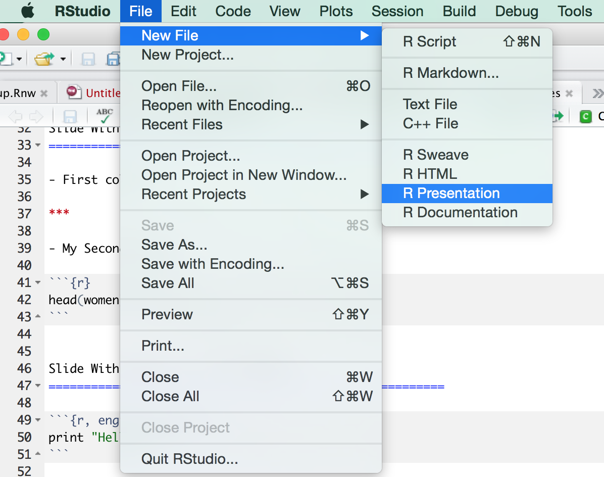
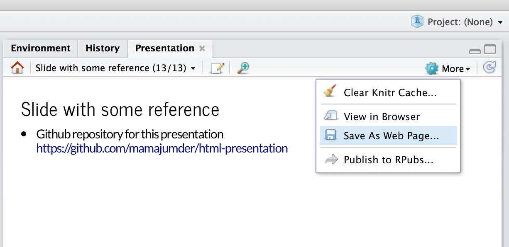

This is the title of the presentation
========================================================
author: Mahbubul Majumder
date: Nov 13, 2014
width: 1340
height: 900

First Slide with external picture
========================================================
- Notice in the source codes how this picture is added here. 



- This picture shows how to create this presentation from RStudio
  - new file will start with a minimal reproducible presentations

Slide with Bullet Points
========================================================

For more details on authoring R presentations click the
**Help** button on the toolbar.

- Bullet 1 required a space after `-` sign
  + sub bullet
     * sub-sub bullet required three more spaces
- Bullet 2. Try to keep bullets simple
- Bullet 3. Try not to write bullet more than a line
  - bullet does not have to be a complete sentence

Slide With R Code
========================================================


```r
summary(cars)
```

```
     speed           dist       
 Min.   : 4.0   Min.   :  2.00  
 1st Qu.:12.0   1st Qu.: 26.00  
 Median :15.0   Median : 36.00  
 Mean   :15.4   Mean   : 42.98  
 3rd Qu.:19.0   3rd Qu.: 56.00  
 Max.   :25.0   Max.   :120.00  
```

Slide With python or Linux command
========================================================
- This is a `python` command. Notice how we changed the engine to `python`

```python
print "Hellow R"
```

```
Hellow R
```

- This is a `Linux` command. Notice how we changed the engine to `bash`

```bash
pwd
```

```
/Users/mmajumder/Box Sync/myweb/data-science/fall-2014/lectures/21-datascience-lab
```

- You can use other commands like `C`, `awk` etc.


Slide With Plot
========================================================
- Notice how the size of the plot is set
 

Slide With two columns
========================================================
left: 70%

- First column has a plot but no R code
 

- Notice the first column is wider since left is set to be 70%

***

- My Second column shows R code with results


```r
head(women)
```

```
  height weight
1     58    115
2     59    117
3     60    120
4     61    123
5     62    126
6     63    129
```

- second column is narrow
  - but why?


Slide with a table created from dataframe
========================================================  

- This will show the head of dataframe mtcars in a table

```r
library(knitr)
kable(head(mtcars), format="html")
```

<table>
 <thead>
  <tr>
   <th style="text-align:left;">   </th>
   <th style="text-align:right;"> mpg </th>
   <th style="text-align:right;"> cyl </th>
   <th style="text-align:right;"> disp </th>
   <th style="text-align:right;"> hp </th>
   <th style="text-align:right;"> drat </th>
   <th style="text-align:right;"> wt </th>
   <th style="text-align:right;"> qsec </th>
   <th style="text-align:right;"> vs </th>
   <th style="text-align:right;"> am </th>
   <th style="text-align:right;"> gear </th>
   <th style="text-align:right;"> carb </th>
  </tr>
 </thead>
<tbody>
  <tr>
   <td style="text-align:left;"> Mazda RX4 </td>
   <td style="text-align:right;"> 21.0 </td>
   <td style="text-align:right;"> 6 </td>
   <td style="text-align:right;"> 160 </td>
   <td style="text-align:right;"> 110 </td>
   <td style="text-align:right;"> 3.90 </td>
   <td style="text-align:right;"> 2.620 </td>
   <td style="text-align:right;"> 16.46 </td>
   <td style="text-align:right;"> 0 </td>
   <td style="text-align:right;"> 1 </td>
   <td style="text-align:right;"> 4 </td>
   <td style="text-align:right;"> 4 </td>
  </tr>
  <tr>
   <td style="text-align:left;"> Mazda RX4 Wag </td>
   <td style="text-align:right;"> 21.0 </td>
   <td style="text-align:right;"> 6 </td>
   <td style="text-align:right;"> 160 </td>
   <td style="text-align:right;"> 110 </td>
   <td style="text-align:right;"> 3.90 </td>
   <td style="text-align:right;"> 2.875 </td>
   <td style="text-align:right;"> 17.02 </td>
   <td style="text-align:right;"> 0 </td>
   <td style="text-align:right;"> 1 </td>
   <td style="text-align:right;"> 4 </td>
   <td style="text-align:right;"> 4 </td>
  </tr>
  <tr>
   <td style="text-align:left;"> Datsun 710 </td>
   <td style="text-align:right;"> 22.8 </td>
   <td style="text-align:right;"> 4 </td>
   <td style="text-align:right;"> 108 </td>
   <td style="text-align:right;"> 93 </td>
   <td style="text-align:right;"> 3.85 </td>
   <td style="text-align:right;"> 2.320 </td>
   <td style="text-align:right;"> 18.61 </td>
   <td style="text-align:right;"> 1 </td>
   <td style="text-align:right;"> 1 </td>
   <td style="text-align:right;"> 4 </td>
   <td style="text-align:right;"> 1 </td>
  </tr>
  <tr>
   <td style="text-align:left;"> Hornet 4 Drive </td>
   <td style="text-align:right;"> 21.4 </td>
   <td style="text-align:right;"> 6 </td>
   <td style="text-align:right;"> 258 </td>
   <td style="text-align:right;"> 110 </td>
   <td style="text-align:right;"> 3.08 </td>
   <td style="text-align:right;"> 3.215 </td>
   <td style="text-align:right;"> 19.44 </td>
   <td style="text-align:right;"> 1 </td>
   <td style="text-align:right;"> 0 </td>
   <td style="text-align:right;"> 3 </td>
   <td style="text-align:right;"> 1 </td>
  </tr>
  <tr>
   <td style="text-align:left;"> Hornet Sportabout </td>
   <td style="text-align:right;"> 18.7 </td>
   <td style="text-align:right;"> 8 </td>
   <td style="text-align:right;"> 360 </td>
   <td style="text-align:right;"> 175 </td>
   <td style="text-align:right;"> 3.15 </td>
   <td style="text-align:right;"> 3.440 </td>
   <td style="text-align:right;"> 17.02 </td>
   <td style="text-align:right;"> 0 </td>
   <td style="text-align:right;"> 0 </td>
   <td style="text-align:right;"> 3 </td>
   <td style="text-align:right;"> 2 </td>
  </tr>
  <tr>
   <td style="text-align:left;"> Valiant </td>
   <td style="text-align:right;"> 18.1 </td>
   <td style="text-align:right;"> 6 </td>
   <td style="text-align:right;"> 225 </td>
   <td style="text-align:right;"> 105 </td>
   <td style="text-align:right;"> 2.76 </td>
   <td style="text-align:right;"> 3.460 </td>
   <td style="text-align:right;"> 20.22 </td>
   <td style="text-align:right;"> 1 </td>
   <td style="text-align:right;"> 0 </td>
   <td style="text-align:right;"> 3 </td>
   <td style="text-align:right;"> 1 </td>
  </tr>
</tbody>
</table>

Slide with a user defined table
========================================================  

- Notice in the codes, how this table is generated

|package| functions|
|-------|-----|
|base| sample, union, intersect, rbind, unique, merge|
|plyr| mutate, transmute|
|reshape2| melt, dcast|
|plyrmr| bind.cols, transmute, select, where, count.cols, quantile.cols, top.k, bottom.k|

Slide with math equation
========================================================  
The normal distribution can be written as 

$$f(x)=\frac1{\sqrt{2\pi \sigma^2}} e^{-\frac1{2\sigma^2} (x-\mu)^2}$$

Symbolically we write $$X \sim N(\mu, \sigma^2)$$


Slide with HTML
========================================================  
<style>

p#myPara{
  color: steelblue;
  font-family: garamond;
  font-size: 1.5em;
}

</style>

<h1> This is the first heading </h1>

<h2> This is the second heading </h2>

<p id="myPara">This is a paragraph. It contains some plain text. The color, font-size and font-family of the texts are changed using CSS style. To check the HTML codes and tags used for this you may need to review the source codes of this presentation.</p>


Slide with D3
========================================================  

- Notice in the source code, how the HTML tags are written to produce this d3 animation.
  - the source could be found as .Rpres file 
  - you can find it on [github](https://github.com/mamajumder/html-presentation)

<head>
<script type="text/javascript" src="http://d3js.org/d3.v3.min.js"></script>
</head>

<svg width=900 height=350>
<circle id="c2" cx="100" cy="100" r="30" fill= "steelblue"></circle>
</svg>

<script>
animate = function() {
 d3.select(this).transition().duration(1500)
   .attr("r", 80).each("end", function () {
  d3.select(this).transition().duration(1500)
    .attr("r", 1).each("end", animate)});
}    
d3.select("#c2").transition().duration(1000)
    .attr("r", 1).each("end", animate);
</script>


Save presentation as HTML
========================================================  
- At top right corner of RStudio, click on `More`, you will find the following options to save the presentation as HTML document.




Slide with some reference
========================================================  

- Github repository for this presentation <br> https://github.com/mamajumder/html-presentation

- Authoring R presentation <br> https://support.rstudio.com/hc/en-us/articles/200486468

- For markdown documentation <br> http://daringfireball.net/projects/markdown/syntax

- Details about ioslides presentation using markdown <br> http://rmarkdown.rstudio.com/ioslides_presentation_format.html
